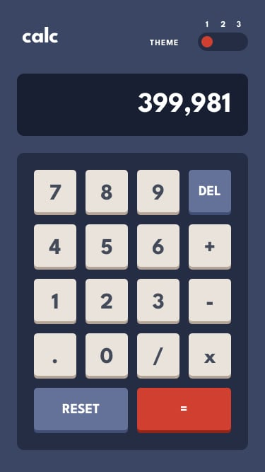

# 🧮 Calculator App

## Live Demo

Check out the live app: [Calculator App](https://13reath.github.io/Calculator-app/)

## Screenshots

### Desktop Version


### Mobile Version



## Technologies Used

-   React
-   Vite
-   Tailwind CSS v4
-   League Spartan Font (Google Fonts)
-   GitHub Pages (for deployment)

## Deployment

1. Make sure your `vite.config.js` includes the correct base path:
    ```js
    export default defineConfig({
      base: "/Calculator-app/",
      ...
    });
    ```
2. Deploy the project using:
    ```bash
    npm run deploy
    ```

---

## Overview

Calculator App is a fully functional calculator with three beautiful themes inspired by modern design principles. Features a responsive design that works seamlessly on desktop and mobile devices, complete with theme switching and smooth animations.

## Table of Contents

-   [Features](#features)
-   [Installation](#installation)
-   [Usage](#usage)
-   [Project Structure](#project-structure)
-   [Development Process](#development-process)
-   [Challenges and Solutions](#challenges-and-solutions)
-   [Future Improvements](#future-improvements)
-   [Contributing](#contributing)

## Features

-   Full calculator functionality (basic arithmetic operations)
-   Three stunning theme options with iOS-style theme switcher
-   Responsive design for all screen sizes (320px - 1440px+)
-   Smooth animations and button press effects
-   Number formatting with commas for large numbers
-   Delete and reset functionality
-   Modern typography with League Spartan font
-   Clean and intuitive user interface

## Installation

1. Clone the repository:
    ```bash
    git clone https://github.com/13reath/Calculator-app.git
    ```
2. Navigate to the project directory:
    ```bash
    cd Calculator-app
    ```
3. Install dependencies:
    ```bash
    npm install
    ```
4. Start the development server:
    ```bash
    npm run dev
    ```

## Usage

-   Select numbers and operations by clicking buttons
-   Switch between three themes using the theme toggle in the header
-   Use DEL to delete the last entered digit
-   Use RESET to clear all calculations
-   Press = to calculate results
-   Enjoy the responsive design on any device

## Project Structure

```
Calculator-app/
├── public/               # Static assets and screenshots
├── src/
│   ├── App.jsx          # Main calculator component with logic
│   ├── main.jsx         # App entry point
│   └── index.css        # Tailwind CSS imports and custom styles
├── vite.config.js       # Vite configuration with Tailwind and base path
├── tailwind.config.js   # Tailwind CSS configuration
├── package.json
└── README.md
```

## Development Process

-   Initialized project with Vite + React + Tailwind CSS v4
-   Implemented three theme system with HSL color values
-   Built responsive grid layout for calculator buttons
-   Added smooth animations and button press effects
-   Implemented complete calculator logic with custom hooks
-   Optimized for GitHub Pages deployment

## Challenges and Solutions

### Theme Switching System

**Problem**: Managing three different color schemes dynamically.  
**Solution**: Created a themes object with HSL values and dynamic style application.

### Responsive Design

**Problem**: Making calculator work on both mobile (375px) and desktop (1440px+).  
**Solution**: Used Tailwind's responsive utilities and flexbox+grid centering.

### Button Animations

**Problem**: Creating satisfying button press effects.  
**Solution**: Implemented mouse event handlers with transform and border animations.

### Number Formatting

**Problem**: Large numbers becoming hard to read.  
**Solution**: Added comma formatting for numbers over 3 digits.

### Tailwind CSS v4 Integration

**Problem**: Using the new Tailwind CSS v4 syntax and configuration.  
**Solution**: Configured @import and @theme directives properly in CSS.

## Future Improvements

-   Add keyboard support for number input
-   Implement scientific calculator mode
-   Add calculation history feature
-   Enable custom theme creation
-   Add sound effects for button presses
-   Implement memory functions (M+, M-, MR, MC)
-   Add copy-to-clipboard functionality

## Contributing

Contributions are welcome!

1. Fork the repository
2. Create a new branch:
    ```bash
    git checkout -b feature/your-feature
    ```
3. Commit your changes:
    ```bash
    git commit -m "Add your feature"
    ```
4. Push to the branch:
    ```bash
    git push origin feature/your-feature
    ```
5. Open a Pull Request
